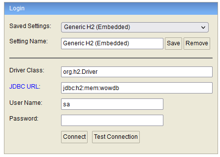

# world-of-wordcraft-Springboot
Game of worldwordhero's

### **View In-Memory Database:**

After the SpringBoot application is started  from: 
WorldOfWordcraftApplication app go to:

http://localhost:9080/h2/

JDBC URL should be set to: 
_jdbc:h2:mem:wowdb_
